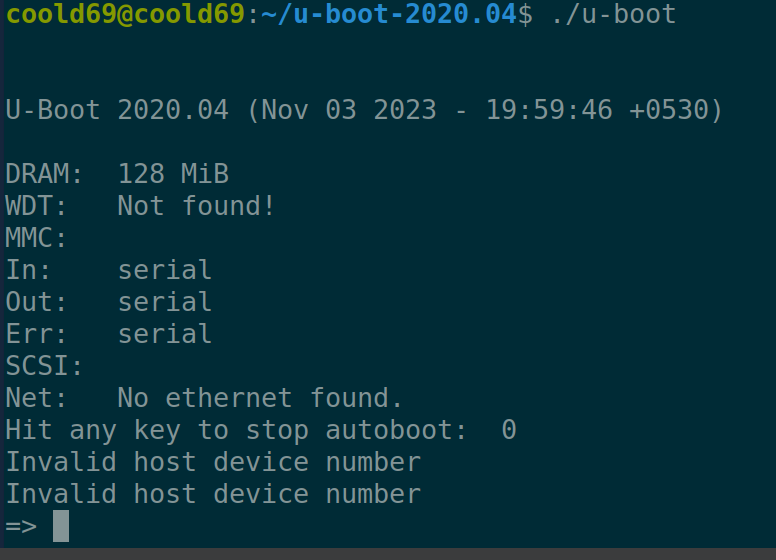

# U-Boot From Scratch
OS: Ubuntu 20.04

## Required Dependencies

```bash
sudo apt-get install gcc gcc-aarch64-linux-gnu
```
```bash
sudo apt-get install bc bison build-essential coccinelle \
  device-tree-compiler dfu-util efitools flex gdisk graphviz imagemagick \
  liblz4-tool libgnutls28-dev libguestfs-tools libncurses-dev \
  libpython3-dev libsdl2-dev libssl-dev lz4 lzma lzma-alone openssl \
  pkg-config python3 python3-asteval python3-coverage python3-filelock \
  python3-pkg-resources python3-pycryptodome python3-pyelftools \
  python3-pytest python3-pytest-xdist python3-sphinxcontrib.apidoc \
  python3-sphinx-rtd-theme python3-subunit python3-testtools \
  python3-virtualenv swig uuid-dev

```

## Get the U-Boot source code
```sh
wget ftp://ftp.denx.de/pub/u-boot/u-boot-2020.04.tar.bz2
```
```bash
tar xvf u-boot-2020.04.tar.bz2
make sandbox64_defconfig
make -j ${nproc}
file ./u-boot
```

## Run U-Boot
```
./u-boot
```

## Project Images



<br/>
<br/>

# Reference

- [https://u-boot.readthedocs.io/en/latest](https://u-boot.readthedocs.io/en/latest)